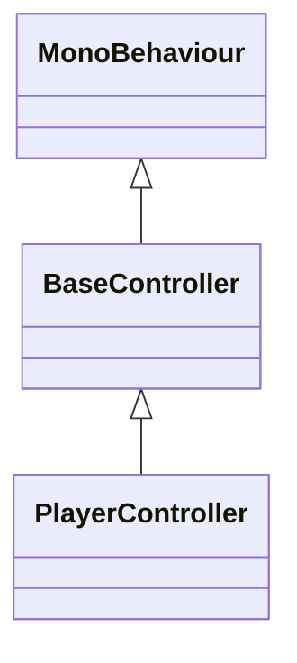

# C# 继承分析器使用手册

<manual>
<identity>
## 工具名称
@tool://csharp-inheritance-analyzer

## 简介
基于Roslyn编译器的C#项目继承关系分析工具，专门用于分析Unity项目中的类继承关系和接口实现关系。
</identity>

<purpose>
## 🎯 核心功能
- **精确解析**: 基于Microsoft Roslyn编译器，提供100%准确的语法分析
- **多向分析**: 支持向上追踪父类、向下查找子类、双向完整分析
- **丰富可视化**: 提供Mermaid图表和Markdown文本树两种展示方式
- **Unity优化**: 专门针对Unity C#项目优化，识别MonoBehaviour组件

## 🚀 使用场景
- 理解大型Unity项目的架构设计
- 重构时分析类层次结构
- 代码审查中检查继承关系合理性
- 新人快速了解项目结构
</purpose>

<parameters>
## 参数说明

### 必需参数
- `targetClass` (string): 要分析的类或接口名称
- `projectPath` (string): Unity项目路径或包含C#文件的目录路径

### 可选参数
- `maxDepth` (number): 继承层级深度限制 (默认: 5, 范围: 1-20)
- `direction` (string): 分析方向
  - `up`: 向上找父类
  - `down`: 向下找子类  
  - `both`: 双向分析 (默认)
- `includeInterfaces` (boolean): 是否包含接口实现关系 (默认: true)
- `autoOpen` (boolean): 是否自动打开浏览器查看结果 (默认: true)
- `theme` (string): 图表主题
  - `unity`: Unity风格主题 (默认)
  - `default`: 默认主题
  - `dark`: 暗色主题
</parameters>

<examples>
## 使用示例

### 基本使用 - 分析PlayerController
```javascript
{
  targetClass: 'PlayerController',
  projectPath: 'C:\\MyUnityProject\\Assets\\Scripts'
}
```

### 向上分析 - 查找父类
```javascript
{
  targetClass: 'EnemyController',
  projectPath: 'C:\\MyProject\\Scripts',
  direction: 'up',
  maxDepth: 10
}
```

### 接口分析
```javascript
{
  targetClass: 'IWeapon',
  projectPath: 'D:\\Project\\Assets',
  direction: 'down',
  includeInterfaces: true
}
```
</examples>

<output>
## 输出结果

工具会生成包含以下内容的HTML报告：

### Mermaid类图


### 继承关系树
- 🏗️ **MonoBehaviour** (Unity基类)
  - 🏗️ **BaseController** (自定义基类)
    - 🏗️ **PlayerController** (目标类)

### 统计信息
- 分析的类总数
- 继承层级深度
- 接口实现关系数量
</output>

<limitations>
## 使用限制

- 仅支持C#项目分析
- 需要项目能够正常编译
- 大型项目分析可能需要较长时间
- 跨程序集的复杂继承关系可能无法完全分析
</limitations>
</manual>